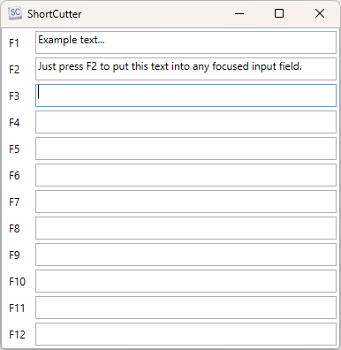

# ShortCutter
Simple Windows application to put prepared text lines into any selected input field by pressing a function key on the keyboard.

The text lines for each F-key are automatically saved on application close.

